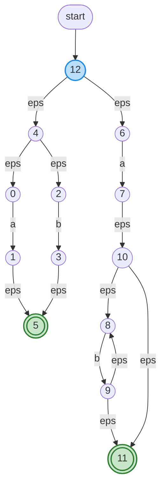

# NFA 生成与验证报告（快速测试）

日期: 2026-05-05

## 目标
- 验证 `seulex` 当前实现是否按语义生成 NFA（尤其是 NFA 结构是否与正则语义一致）。
- 生成若干小样例的 Mermaid 可视化以便人工核对。
- 排查一个在测试中发现的问题（quoted-string 行被解析为空）。

## 已执行步骤
- 在 `src/main.cpp` 中启用了当传入 `-d` 时输出 Mermaid 的调试块（已构建）。
- 新增三个测试输入：
  - [test_inputs/simple1.l](test_inputs/simple1.l) — 单字符 `a`。
  - [test_inputs/simple2.l](test_inputs/simple2.l) — alternation 与 star (`a|b`、`ab*`)。
  - [test_inputs/simple3.l](test_inputs/simple3.l) — 标识符与字符串字面量样例。
- 构建并运行 `SeuLex -d`，将 Mermaid 输出保存为：
  - [test_outputs/simple1.mmd](test_outputs/simple1.mmd)
  - [test_outputs/simple2.mmd](test_outputs/simple2.mmd)
  - [test_outputs/simple3.mmd](test_outputs/simple3.mmd)
- 在 `simple3.l` 上发现一处测试输入自身的转义问题（文件中存在过度转义的 `\\`），已修正为正确的单反斜杠形式。
- 为定位问题曾短时加入调试打印，问题确认后已移除相关调试代码并重新构建。

## 主要发现
- `NfaBuilder` 在 `src/automata/nfa_builder.cpp` 中实现了标准的 Thompson 构造法（支持 `Char`、`CharClass`、`Concat`、`Alter`、`Star`、`Plus`、`Option`），总体实现与文档一致。
- `main.cpp` 将每条规则的 accept 状态标记为 `is_accept` 并写入 `rule_index`/`action_index`，随后用 `append_unified_entry_state` 合并规则起点；这也符合典型的 NFA 合并逻辑。
- `NfaVisualizer` 能把多个字符转移合并为紧凑的集合（例如输出 `A-Z,_,a-z`），适合人工检查。
- 在本次测试中，生成的 NFA 与正则语义一致：
  - `simple1.l`（`a`）生成 3 个状态，单字符转移指向接受态。
  - `simple2.l`（`a|b`, `ab*`）生成的 NFA 展示了 alternation 与 star 的典型结构（可在 [test_outputs/simple2.mmd](test_outputs/simple2.mmd) 查看）。
  - `simple3.l`（标识符与字符串）在修复测试输入后正确解析并生成 NFA；字符串样例被转换为逐字符的字面量匹配（见 [test_outputs/simple3.mmd](test_outputs/simple3.mmd)）。

## 已修复的小问题
- 问题表现：在初次创建的 `test_inputs/simple3.l` 中，第二条规则被解析成空字符串（`Rule 1:  => `）。
- 根因：测试文件中用于表示转义的反斜杠被过度转义（文件中实际包含 `\\` 字节序列），导致扫描器在识别双引号结束位置时误判，从而未正确找到 action 起始位置。
- 处理：已将 `test_inputs/simple3.l` 中的过度转义改为单一反斜杠（文件已更新），并移除调试打印，重新构建与运行，问题解决。

## 限制与后续建议
- 当前实现把字符类展开为 256 条可能的字节转移（字节级 NFA），对 Unicode/多字节字符支持有限，且大字符类会增大 NFA 规模和内存占用。
- Flex 的高级语义（起始条件 `%s/%x`、尾随上下文 `/`、行首/行尾锚点等）尚未完全并入 automata 构造（`IMPLEMENTATION_NOTES.md` 中已有说明）。如需完整兼容 Flex，这些点需要进一步实现。
- 建议接下来的工作：
  1. 为 `converter`、`parser`、`nfa_builder` 添加单元/回归测试，利用本次生成的 `*.mmd` 作为可视化断言或人工审查参考。
  2. 实现 NFA→DFA 子集构造与最小化，并在转换后比较接受语义以确保行为一致。
  3. 为字符类优化存储（例如区间合并、位集或位图）以降低大类的内存/时间成本。

## 如何复现（命令）
在项目根目录下运行：
```bash
cmake -S . -B build -G Ninja -DCMAKE_BUILD_TYPE=Debug
cmake --build build
cd build
./SeuLex -d ../test_inputs/simple1.l > ../test_outputs/simple1.mmd
./SeuLex -d ../test_inputs/simple2.l > ../test_outputs/simple2.mmd
./SeuLex -d ../test_inputs/simple3.l > ../test_outputs/simple3.mmd
```

## 附件（已生成文件）
- [test_outputs/simple1.mmd](test_outputs/simple1.mmd)
- [test_outputs/simple2.mmd](test_outputs/simple2.mmd)
- [test_outputs/simple3.mmd](test_outputs/simple3.mmd)

## 可视化
simple1

simple2

simple3
```mermaid
graph TD
  start([start])
  start --> q32
  q0((0))
  q1((1))
  q2((2))
  q3((3))
  q4((4))
  q5(((5)))
  q6((6))
  q7((7))
  q8((8))
  q9((9))
  q10((10))
  q11((11))
  q12((12))
  q13((13))
  q14((14))
  q15((15))
  q16((16))
  q17((17))
  q18((18))
  q19((19))
  q20((20))
  q21((21))
  q22((22))
  q23((23))
  q24((24))
  q25((25))
  q26((26))
  q27((27))
  q28((28))
  q29((29))
  q30((30))
  q31(((31)))
  q32((32))
  q0 -->|A-Z,_,a-z| q1
  q1 -->|eps| q4
  q2 -->|0-9,A-Z,_,a-z| q3
  q3 -->|eps| q2
  q3 -->|eps| q5
  q4 -->|eps| q2
  q4 -->|eps| q5
  q6 -->|(| q7
  q7 -->|eps| q8
  q8 -->|\\| q9
  q9 -->|eps| q10
  q10 -->|.| q11
  q11 -->|eps| q12
  q12 -->||| q13
  q13 -->|eps| q14
  q14 -->|[| q15
  q15 -->|eps| q16
  q16 -->|^| q17
  q17 -->|eps| q18
  q18 -->|\\| q19
  q19 -->|eps| q20
  q20 -->|\"| q21
  q21 -->|eps| q22
  q22 -->|\\| q23
  q23 -->|eps| q24
  q24 -->|n| q25
  q25 -->|eps| q26
  q26 -->|]| q27
  q27 -->|eps| q28
  q28 -->|)| q29
  q29 -->|eps| q30
  q30 -->|*| q31
  q32 -->|eps| q0
  q32 -->|eps| q6
  classDef startState fill:#bbdefb,stroke:#1e88e5,stroke-width:2px
  classDef acceptState fill:#c8e6c9,stroke:#2e7d32,stroke-width:2px
  class q32 startState
  class q5 acceptState
  class q31 acceptState
```